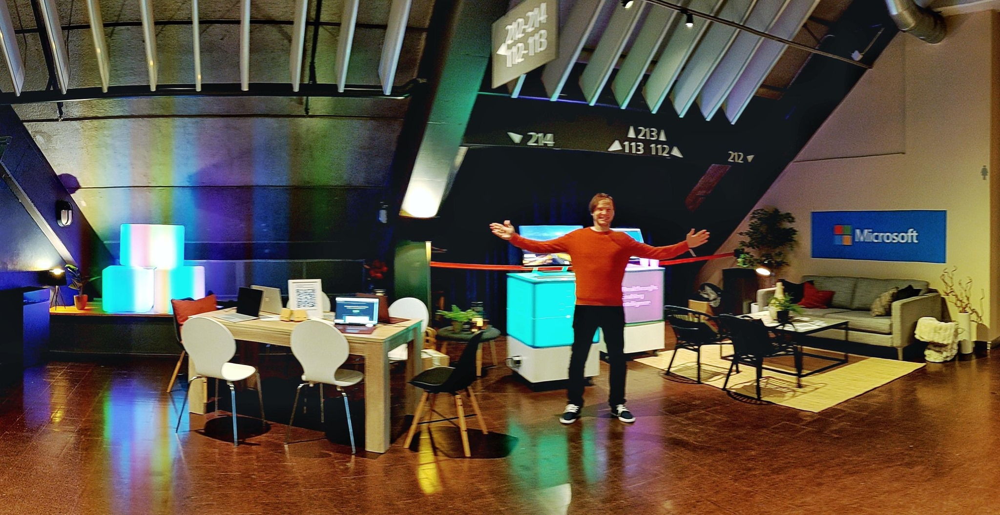

# Welcome to Microsoft booth at JavaZone!

To get cool prizes, join one or both of the learning challenges. It will take only a few minutes to complete them!

    

## 1. [JavaZone challenge #1: Deploy a web app to Azure using guide, and get a backpack! Using laptop recommended.](https://docs.microsoft.com/en-gb/learn/challenges?ns-enrollment-type=Collection&ns-enrollment-id=yk5esdzo2k1g3q&id=ad50e385-2073-4e25-9267-8063f587ba99&ocid=AID3054631)

Start and complete a "learning by doing" guide about hosting your app on Azure, and return to the Microsoft area to get your prize.

    

1. Open the link above and click "Join the challenge"
2. Log in using Microsoft account
3. Create your free MS Learn profile (if you don't have it yet)
4. Click "Start learning"
5. Follow the steps to get your web app hosted on Azure. You can choose between deploying a demo app written with C#, NodeJS, Java, or Python (you don't need to create the app itself). There is Azure sandbox offered for this exercise, so you will host this app FOR FREE.

**How to claim prize?**
To get the prize, return to Microsoft booth and demonstrate:
- your name on the [Leaderboard](https://docs.microsoft.com/en-gb/learn/challenges?ns-enrollment-type=Collection&ns-enrollment-id=yk5esdzo2k1g3q&id=ad50e385-2073-4e25-9267-8063f587ba99&ocid=AID3054631) AND
- the url YOUR-APP-NAME.azurewebsites.net of the hosted application

**How to run similar challenge for your company?**
Ask Maxim Salnikov by email [maxim.salnikov@microsoft.com](mailto:maxim.salnikov@microsoft.com)

## 2. [JavaZone challenge #2: Learn about choosing right Azure service for Java app, and get a prize! You can do it on your phone.](https://docs.microsoft.com/en-gb/learn/challenges?ns-enrollment-type=Collection&ns-enrollment-id=yk5esdzo2k1g3q&id=7ce66299-a51e-47d4-a3de-4459b98fcf0b&ocid=AID3054631)

Start and complete the guide about Azure service for Java app, and return to the Microsoft area to get your prize.

1. Open the link above and click "Join the challenge"
2. Log in using Microsoft account
3. Create your free MS Learn profile (if you don't have it yet)
4. Click "Start learning"
5. Go through all pages of the guide (it will take less than 10 minutes, you can use your phone)

**How to claim prize?**
To get the prize, return to Microsoft booth and demonstrate your name on the [Leaderboard](https://docs.microsoft.com/en-gb/learn/challenges?ns-enrollment-type=Collection&ns-enrollment-id=yk5esdzo2k1g3q&id=7ce66299-a51e-47d4-a3de-4459b98fcf0b&ocid=AID3054631)

**How to run similar challenge for your company?**
Ask Maxim Salnikov by email [maxim.salnikov@microsoft.com](mailto:maxim.salnikov@microsoft.com)

### Good luck with the challenges!
Any questions? Message Maxim Salnikov on [LinkedIn](https://linkedin.com/in/webmax) or email [maxim.salnikov@microsoft.com](mailto:maxim.salnikov@microsoft.com)
