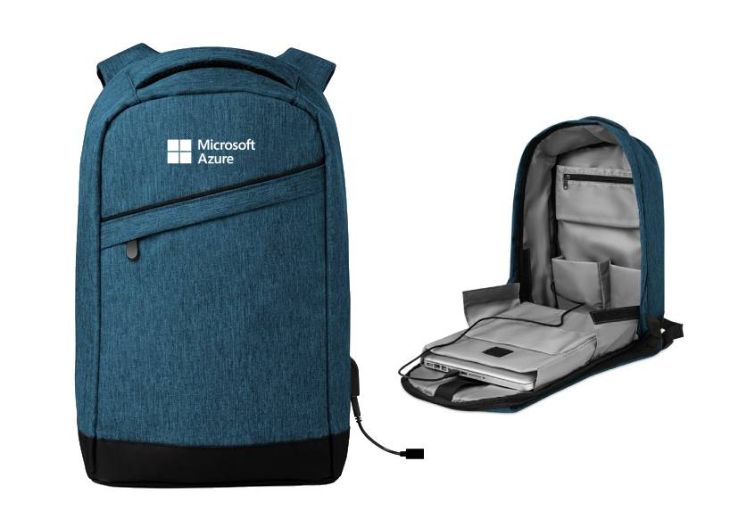

# Welcome to Microsoft virtual booth at JavaZone!

    

## Challenges and prizes!

Start and complete one or both learning challenges we prepared for you and return to this page to learn how to claim your prize(s).

### [JZ Challenge #1: Learn Azure Static Web Apps to get a secret prize](https://docs.microsoft.com/en-us/learn/challenges?ocid=aid3040683&id=34f240f3-566f-424c-82fe-01672466d00f)

1. Click "Join the challenge" 
2. Log in using Microsoft account
3. Create your free MS Learn profile (if you don't have it yet)
4. Check "I agree" to receive tech newsletter
5. Click "Start learning"
6. Read all pages

**How to claim prize?**
Email [maxim.salnikov@microsoft.com](mailto:maxim.salnikov@microsoft.com) your name on the Leaderboard to get further instructions

    

### [JZ Challenge #2: Deploy a web app to Azure to get a MS backpack](https://docs.microsoft.com/en-us/learn/challenges?ocid=aid3040683&id=2e7537da-637b-4027-bc92-cb30b94acb6a)

1. Click "Join the challenge"
2. Log in using Microsoft account
3. Create your free MS Learn profile (if you don't have it yet)
4. Click "Start learning"
5. Follow the steps to get your web app hosted on Azure. You can choose between deploying a demo app written with C#, NodeJS, Java, or Python (you don't need to create the app itself). There is Azure sandbox offered for this exercise, so you will host this app FOR FREE.

**How to claim prize?**
Email [maxim.salnikov@microsoft.com](mailto:maxim.salnikov@microsoft.com) the url YOUR-APP-NAME.azurewebsites.net of the hosted application to get further instructions

### Good luck with the challenges!
Any questions? Find Maxim Salnikov on JZ21 Slack or email [maxim.salnikov@microsoft.com](mailto:maxim.salnikov@microsoft.com)
